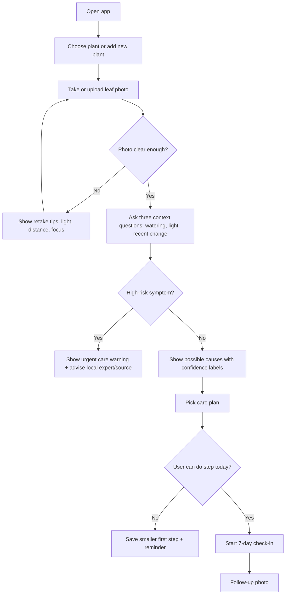

# Diagnose My Plant - Task Flow

Unhappy paths:
1. Bad photo quality: retake with specific guidance.
2. Risky diagnosis: avoid false certainty and route to expert/source.
3. User cannot do full care plan: shrink to one first step.

